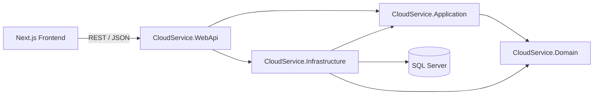

# NovaCloud — Cloud Service Platform

NovaCloud is a full-stack cloud-service website for managing and selling VPS, Hosting, Domain and related service plans. The project was built for the **Object-Oriented Software Development** course and focuses on Clean Architecture, REST API design, role-based security, testing, CI/CD and containerized deployment.

## Highlights

- Public catalog for cloud services, pricing, news, contact, affiliate and order requests.
- Customer account with request history, notifications and password management.
- Admin/Editor console for service plans, pricing, promotions, news, requests, users, audit logs and dashboard statistics.
- JWT authentication with refresh tokens and role-based authorization (`Admin`, `Editor`, `User`).
- PBKDF2 password hashing through ASP.NET Core `PasswordHasher<TUser>`.
- QR code generation for service plans with PNG/SVG output through a Factory pattern.
- Request reference codes (`ORD-*`, `CON-*`, `AFF-*`) and secure request tracking by code + email.
- Email notifications, in-app notifications, Excel order export and audit logging.
- RFC 7807 ProblemDetails, rate limiting and API/database health checks.
- SQL Server + Entity Framework Core migrations.
- **71 xUnit + Moq tests**.
- GitHub Actions for backend build/test, frontend build and Docker validation/build.
- Docker Compose for ASP.NET Core API + SQL Server 2022.

## Technology Stack

| Layer | Technology |
|---|---|
| Frontend | Next.js, React, TypeScript, Tailwind CSS, Lucide React |
| Web API | ASP.NET Core Web API (.NET 8) |
| Application | C# application services, DTOs, interfaces |
| Domain | C# entities, enums, constants |
| Infrastructure | EF Core 8, SQL Server, repositories, Excel export |
| Authentication | JWT Bearer + Refresh Token |
| Password hashing | ASP.NET Core `PasswordHasher<AppUser>` (PBKDF2) |
| QR | QRCoder |
| Testing | xUnit, Moq, Coverlet |
| CI/CD | GitHub Actions |
| Containerization | Docker, Docker Compose, SQL Server 2022 |

## Architecture

NovaCloud follows a four-project Clean Architecture structure:



Project dependency direction:

```text
CloudService.Domain
        ↑
CloudService.Application
        ↑             ↑
CloudService.Infrastructure   CloudService.WebApi
        ↑_____________________↑
```

The Domain project does not reference Application, Infrastructure or WebApi. More details: [`docs/architecture.md`](docs/architecture.md).

## Design Patterns

The project demonstrates at least three patterns required by the assignment:

1. **Repository Pattern** — generic data-access abstraction through `IRepository<T>` / `Repository<T>`.
2. **Unit of Work Pattern** — coordinates repositories and a single `SaveChangesAsync()` transaction boundary.
3. **Factory Pattern** — `IQrCodeGeneratorFactory` selects PNG or SVG QR generators.

See [`docs/design-patterns.md`](docs/design-patterns.md).

## User Roles

| Role | Main permissions |
|---|---|
| `Admin` | Full administration, pricing, promotions, categories, service plans, users/roles, audit logs, QR regenerate |
| `Editor` | Operational content/workflow such as News, Orders, Affiliate, Contact and dashboard |
| `User` | Customer account, personal request history, notifications and password change |
| Anonymous | Browse public pages, submit Order/Contact/Affiliate requests and track requests by reference code + email |

## Main Features

### Public Website

- Home, About, Customers / Testimonials
- Services and Service Detail
- Pricing and Promotions
- News list/detail
- Contact request
- Order request
- Affiliate application
- Request Tracking using reference code + email
- Service-plan QR code

### Customer Account

- `/login` customer login and registration
- `/account` overview
- `/account/requests` Order / Contact / Affiliate history linked by the authenticated user's email
- `/account/notifications`
- `/account/security` password change

### Admin / Editor Console

- Dashboard statistics and recent activity
- Service Plan management
- Service Category management
- Plan Price management
- Promotion management
- QR preview / regenerate / PNG-SVG download
- News CRUD + image upload
- Order workflow + Excel export
- Affiliate workflow
- Contact workflow
- User / Role / Active-status management
- Notification center
- Audit Log
- Security settings / password change

## Database

Primary entities:

- `ServiceCategory`
- `ServicePlan`
- `PlanPrice`
- `Promotion`
- `NewsArticle`
- `OrderRequest`
- `AffiliateApplication`
- `ContactRequest`
- `AppUser`
- `Notification`
- `AuditLog`

The complete ERD and relationship notes are in [`docs/database.md`](docs/database.md).

## Security

NovaCloud includes:

- JWT access token + refresh token rotation/revocation.
- Role-based authorization with `Admin`, `Editor`, `User`.
- Current account role / active-state revalidation during JWT validation.
- PBKDF2 password hashing via ASP.NET Core Identity password hasher.
- JWT signing key removed from source configuration; use User Secrets locally and environment variables in Docker/production.
- Rate limiting for authentication and public request tracking.
- ProblemDetails error responses with `traceId`.
- Audit logs for administrative actions.
- Secure request tracking requiring both reference code and email.

See [`docs/security.md`](docs/security.md).

## Prerequisites

For local development:

- .NET SDK 8.x
- Node.js 22.x recommended
- SQL Server LocalDB / SQL Server
- npm

For Docker:

- Docker Desktop / Docker Engine with Docker Compose v2

## Run Locally

### 1. Configure the database

Set `ConnectionStrings:DefaultConnection` using `appsettings.Development.json` or User Secrets according to your local SQL Server setup.

### 2. Configure JWT signing key

Run once on your machine:

```powershell
dotnet user-secrets set `
  "Jwt:Key" `
  "REPLACE_WITH_A_RANDOM_SECRET_AT_LEAST_32_CHARACTERS" `
  --project backend\CloudService.WebApi
```

Do not commit real secrets.

### 3. Apply EF Core migrations

```powershell
dotnet ef database update `
  --project backend\CloudService.Infrastructure `
  --startup-project backend\CloudService.WebApi
```

### 4. Run backend

```powershell
dotnet run --project backend\CloudService.WebApi
```

Default development API port in this project is normally `http://localhost:5128`.

Swagger:

```text
http://localhost:5128/swagger
```

Health check:

```text
http://localhost:5128/health
```

### 5. Run frontend

Open another terminal:

```powershell
npm --prefix frontend install
npm --prefix frontend run dev
```

Frontend:

```text
http://localhost:3000
```

## Run with Docker Compose

Create a private `.env` from `.env.example`:

```powershell
Copy-Item .env.example .env
```

Set strong private values for:

```text
MSSQL_SA_PASSWORD=...
JWT_KEY=...
DEMO_USERS_PASSWORD=...
```

Then:

```powershell
docker compose up --build -d
docker compose ps
```

Expected services:

```text
novacloud-sqlserver   ... (healthy)
novacloud-api         ... (healthy)
```

Docker API / Swagger:

```text
http://localhost:5128
http://localhost:5128/swagger
http://localhost:5128/health
```

The frontend is currently run separately on the host with Next.js and calls the Docker API at port `5128`.

Full instructions: [`docs/deployment.md`](docs/deployment.md).

## Development Demo Accounts

When Docker runs with `ASPNETCORE_ENVIRONMENT=Development` and `Database__SeedDemoUsers=true`, the API can seed these accounts if they do not already exist:

| Role | Email |
|---|---|
| Admin | `admin@novacloud.local` |
| Editor | `editor@novacloud.local` |
| User | `user@novacloud.local` |

The password comes from `DEMO_USERS_PASSWORD` in the private `.env` file. The repository's example default is development-only and must not be reused in production.

## Testing

Run all tests:

```powershell
dotnet test CloudService.slnx
```

Current test suite: **71 xUnit tests** across application services and utilities.

Generate coverage:

```powershell
dotnet test CloudService.slnx --collect:"XPlat Code Coverage"
```

More details: [`docs/testing-ci.md`](docs/testing-ci.md).

## CI/CD

GitHub Actions workflow: `.github/workflows/ci.yml`

It contains three main jobs:

- `Backend - Build & Test`
- `Frontend - Build`
- `Docker - Validate & Build`

The Docker job validates `docker compose config` and builds the Web API image after backend and frontend jobs succeed.

## Repository Structure

```text
cloud-service-platform/
├── backend/
│   ├── CloudService.Domain/
│   ├── CloudService.Application/
│   ├── CloudService.Infrastructure/
│   ├── CloudService.WebApi/
│   └── CloudService.Tests/
├── frontend/
│   └── src/app/
├── docs/
├── .github/workflows/ci.yml
├── docker-compose.yml
├── CloudService.slnx
└── README.md
```

## Documentation

- [Architecture](docs/architecture.md)
- [Database / ERD](docs/database.md)
- [Design Patterns](docs/design-patterns.md)
- [Security](docs/security.md)
- [Testing & CI](docs/testing-ci.md)
- [Deployment / Docker](docs/deployment.md)
- [Demo Guide](docs/demo-guide.md)

## Notes

- `.env`, User Secrets and SMTP credentials must never be committed.
- Docker demo-user seeding is intended only for Development.
- The API uses SQL Server; EF Core migrations are stored in `CloudService.Infrastructure`.
