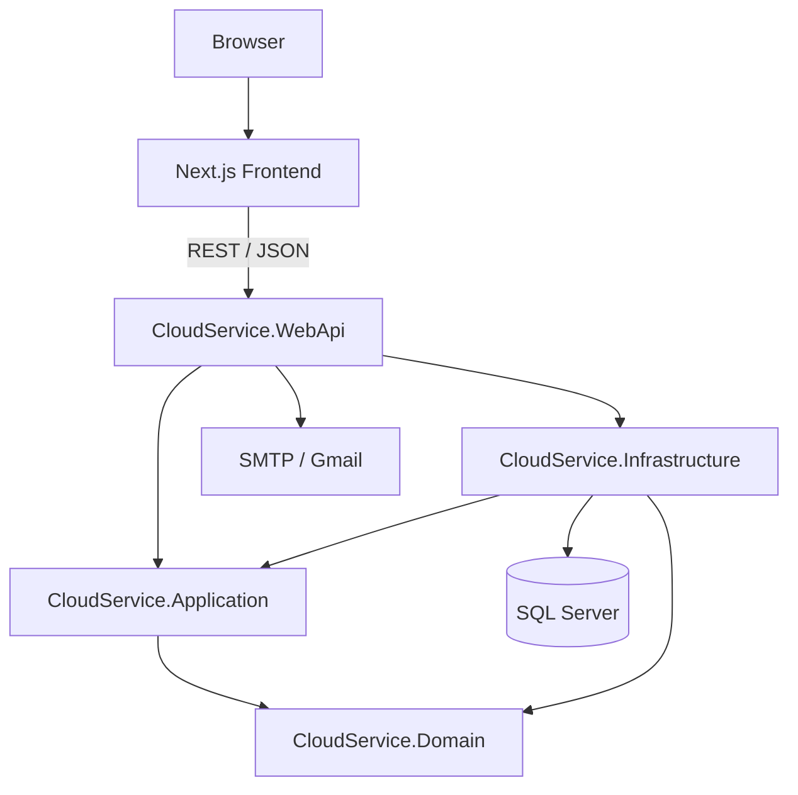
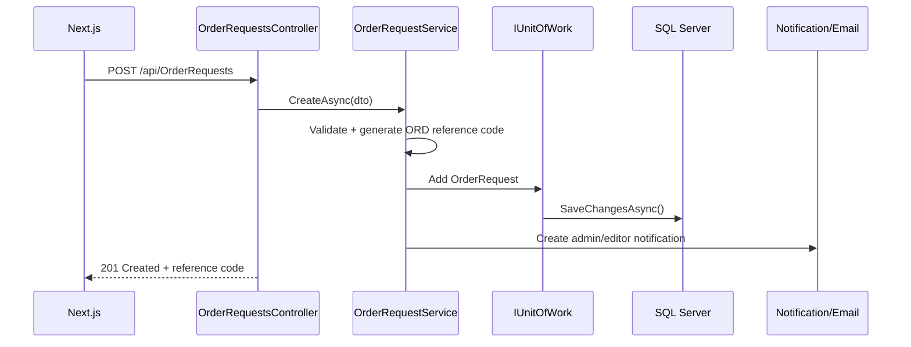

# NovaCloud Architecture

## 1. Overview

NovaCloud is organized using Clean Architecture principles. Business concepts live in the Domain layer, use cases and abstractions live in Application, external technical concerns live in Infrastructure, and HTTP composition/hosting lives in WebApi.



## 2. Project Dependencies

Actual project references in the solution:

```text
CloudService.Domain
  └─ no project dependency

CloudService.Application
  └─ CloudService.Domain

CloudService.Infrastructure
  ├─ CloudService.Application
  └─ CloudService.Domain

CloudService.WebApi
  ├─ CloudService.Application
  └─ CloudService.Infrastructure

CloudService.Tests
  ├─ CloudService.Domain
  └─ CloudService.Application
```

This means the inner `Domain` layer does not depend on outer frameworks such as ASP.NET Core or EF Core.

## 3. Layer Responsibilities

### CloudService.Domain

Contains core domain concepts:

- `ServiceCategory`
- `ServicePlan`
- `PlanPrice`
- `Promotion`
- `AppUser`
- `NewsArticle`
- `OrderRequest`
- `AffiliateApplication`
- `ContactRequest`
- `Notification`
- `AuditLog`
- `OrderStatus`
- role constants

It contains no database or HTTP implementation.

### CloudService.Application

Contains application use cases and abstractions:

- DTOs
- service interfaces and implementations
- `IRepository<T>`
- `IUnitOfWork`
- QR abstractions
- email abstraction
- authentication/JWT service abstractions
- request tracking
- dashboard/customer-account/user-management use cases

The Application layer depends on Domain but not on EF Core or ASP.NET controllers.

### CloudService.Infrastructure

Contains technical persistence/export implementations:

- `CloudServiceDbContext`
- EF Core migrations
- `Repository<T>`
- `UnitOfWork`
- SQL Server integration
- Excel order export

Infrastructure implements abstractions required by Application.

### CloudService.WebApi

Acts as the composition root and HTTP adapter:

- API controllers
- Swagger/OpenAPI
- JWT bearer authentication
- authorization
- global ProblemDetails handling
- rate limiting
- health checks
- CORS
- QR implementation and factory
- SMTP email sender
- dependency injection registrations
- Development/Docker migration and demo-user seeding

## 4. Typical Request Flow

Example: customer submits an Order Request.



## 5. Dependency Rule

The important rule is **source-code dependency points inward**:

```text
WebApi / Infrastructure
        ↓
    Application
        ↓
      Domain
```

Application defines interfaces for technical operations when appropriate, while outer layers provide concrete implementations. This allows business use cases to be unit-tested with mocks without requiring SQL Server, SMTP or a running web server.
