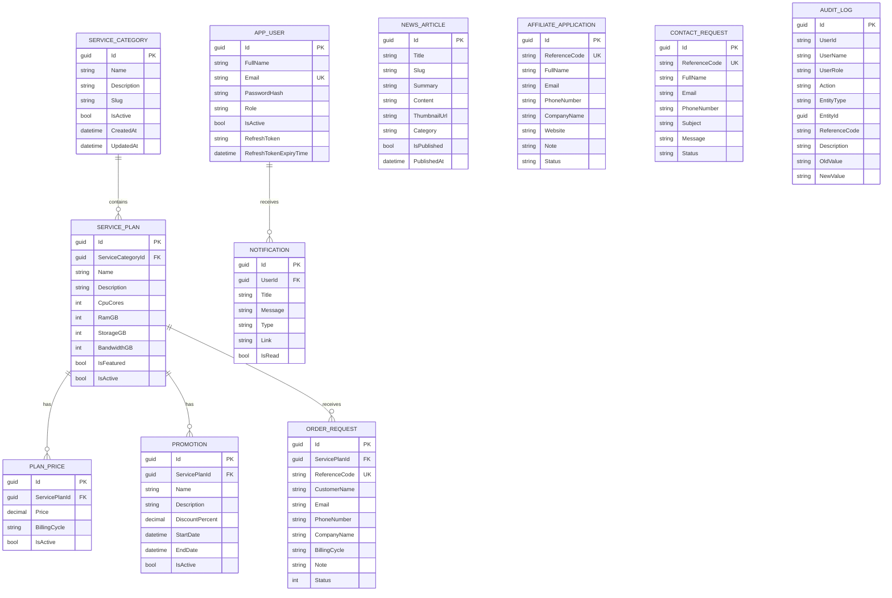

# Database and ERD

## 1. Database Technology

- SQL Server
- Entity Framework Core 8
- Code-first migrations
- `CloudServiceDbContext` in `CloudService.Infrastructure`

Every domain entity inherits `BaseEntity`, which provides:

- `Id : Guid`
- `CreatedAt : DateTime`
- `UpdatedAt : DateTime?`

## 2. ERD



## 3. Relationship Notes

### ServiceCategory → ServicePlan

One category contains many service plans.

```text
ServiceCategory.Id
      ↓ 1:N
ServicePlan.ServiceCategoryId
```

### ServicePlan → PlanPrice

One service plan can expose multiple billing prices, for example monthly/yearly.

### ServicePlan → Promotion

One service plan can have multiple promotions.

### ServicePlan → OrderRequest

Every order request refers to the selected `ServicePlanId`.

### AppUser → Notification

`Notification.UserId` is an EF Core foreign key to `AppUser`; delete behavior is Cascade.

## 4. Email-based Customer History

`OrderRequest`, `ContactRequest` and `AffiliateApplication` intentionally keep customer email directly instead of requiring an `AppUser` foreign key. This supports anonymous users submitting requests before registering.

After a customer creates an account with the same email, the Customer Account service can show those earlier requests by normalized authenticated email.

## 5. Important Constraints / Indexes

The DbContext configures:

- unique `AppUser.Email`
- unique filtered reference codes for Order / Contact / Affiliate
- `PlanPrice.Price` precision `(18,2)`
- `Promotion.DiscountPercent` precision `(5,2)`
- Notification indexes by `UserId` and `(UserId, IsRead)`
- Audit Log indexes for time/action/entity/user
- Contact status and created-time indexes
