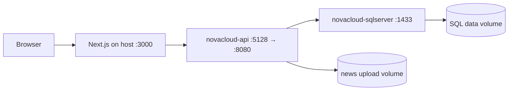

# Deployment and Docker Guide

## 1. Local Development

### Backend

Configure local SQL Server and JWT User Secret, then:

```powershell
dotnet run --project backend\CloudService.WebApi
```

### Frontend

```powershell
npm --prefix frontend install
npm --prefix frontend run dev
```

Default development URLs used by the project:

```text
Frontend: http://localhost:3000
API:      http://localhost:5128
Swagger:  http://localhost:5128/swagger
Health:   http://localhost:5128/health
```

## 2. Docker Compose Architecture



Compose currently containerizes:

- ASP.NET Core API
- SQL Server 2022

The Next.js frontend is run separately on the host for the current classroom/demo workflow.

## 3. Private Environment File

Create `.env`:

```powershell
Copy-Item .env.example .env
```

Set private values:

```text
MSSQL_SA_PASSWORD=<strong SQL Server password>
DEMO_USERS_PASSWORD=<development demo password>
JWT_KEY=<random secret at least 32 characters>
```

`.env` is ignored by Git and must not be included in submission archives containing secrets.

## 4. Start Docker

```powershell
docker compose up --build -d
```

Check status:

```powershell
docker compose ps
```

Expected:

```text
novacloud-sqlserver   Up ... (healthy)
novacloud-api         Up ... (healthy)
```

Test health:

```powershell
Invoke-WebRequest http://localhost:5128/health -UseBasicParsing
```

Expected:

```text
StatusCode : 200
Content    : Healthy
```

## 5. Database Startup

In Docker, the API uses:

```text
Database__ApplyMigrationsOnStartup=true
```

The application retries EF Core migration while SQL Server is starting. Docker also declares `depends_on` with a SQL Server health condition.

Development demo users are seeded only when:

```text
ASPNETCORE_ENVIRONMENT=Development
Database__SeedDemoUsers=true
```

## 6. Persistent Volumes

```text
novacloud_sql_data
novacloud_news_uploads
```

Therefore:

```powershell
docker compose down
```

stops containers but keeps data.

To deliberately remove volumes/database data:

```powershell
docker compose down -v
```

Use `-v` only when a full reset is intended.

## 7. Recommended Presentation Setup

For a classroom demo:

1. Start Docker Desktop before presenting.
2. Run `docker compose up -d`.
3. Verify `docker compose ps` shows API and SQL Server as healthy.
4. Run the prebuilt Next.js frontend on the host.
5. Keep Swagger and `/health` available as technical proof.
6. Keep local backend execution as a fallback if Docker has an unexpected machine/WSL issue.

## 8. Stop After Demo

```powershell
docker compose down
```
