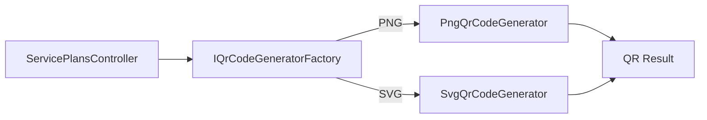

# Design Patterns Used in NovaCloud

## 1. Repository Pattern

### Goal

Separate application logic from direct EF Core data-access calls.

### Project implementation

Abstraction:

```text
CloudService.Application/Interfaces/Repositories/IRepository<T>
```

Implementation:

```text
CloudService.Infrastructure/Repositories/Repository<T>
```

Core operations:

```csharp
Task<T?> GetByIdAsync(Guid id);
Task<IEnumerable<T>> GetAllAsync();
Task AddAsync(T entity);
void Update(T entity);
void Delete(T entity);
```

### Benefit

- Application services depend on abstractions.
- Data access can be replaced/mocked more easily.
- Repeated CRUD operations are centralized.

---

## 2. Unit of Work Pattern

### Goal

Coordinate repositories through one DbContext and one save boundary.

Abstraction:

```text
CloudService.Application/Interfaces/IUnitOfWork
```

Implementation:

```text
CloudService.Infrastructure/Repositories/UnitOfWork
```

Important operations:

```csharp
IRepository<T> Repository<T>() where T : class;
Task<int> SaveChangesAsync();
```

### Example

A service can add/update multiple entities and then call `SaveChangesAsync()` once instead of letting each repository independently commit.

### Benefit

- clearer transaction boundary
- common DbContext lifetime
- reduced persistence coupling in application services

---

## 3. Factory Pattern — QR Code Generator

### Goal

Create QR output in different formats without controllers knowing concrete generator classes.

Abstractions:

```text
IQrCodeGenerator
IQrCodeGeneratorFactory
QrCodeFormat
```

Concrete generators:

```text
PngQrCodeGenerator
SvgQrCodeGenerator
```

Factory:

```text
QrCodeGeneratorFactory
```

Flow:



### Benefit

The controller requests a format; the factory decides which concrete generator to return. Adding another format does not require embedding format-selection logic throughout the controller.

---

## 4. Dependency Inversion in the Project

Patterns are combined with dependency inversion:

```text
Application defines abstractions
        ↑
Infrastructure / WebApi provide implementations
```

Examples:

- `IRepository<T>` → `Repository<T>`
- `IUnitOfWork` → `UnitOfWork`
- `IEmailSender` → `SmtpEmailSender`
- `IQrCodeGeneratorFactory` → `QrCodeGeneratorFactory`

This is important: simply having an interface is not enough; the abstraction should be owned by an inner layer when the inner use case needs the capability, and the outer layer should supply the implementation.
