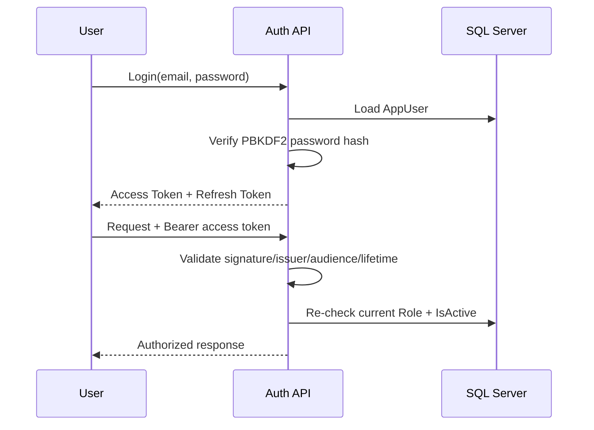

# Security Design

## 1. Authentication

NovaCloud uses JWT Bearer authentication.

Authentication flow:



## 2. Password Storage

Passwords are not encrypted for later decryption. They are hashed through ASP.NET Core:

```text
IPasswordHasher<AppUser>
PasswordHasher<AppUser>
```

ASP.NET Core's password hasher uses a PBKDF2-based password hashing format with salt and work factor metadata.

## 3. Access Token and Refresh Token

### Access Token

- short-lived authorization credential
- sent in `Authorization: Bearer ...`
- contains identity/role claims

### Refresh Token

- stored on the user's server-side account record
- used to obtain a new access token
- rotated/revoked according to the authentication workflow

Role or active-status changes also invalidate the practical usefulness of old sessions because every validated JWT request checks the current database account state.

## 4. Role-Based Authorization

Roles:

```text
Admin
Editor
User
```

Examples:

- Audit Log and User Management: Admin only
- Service Category / Price / Promotion / Service Plan writes: Admin only
- Order / Contact / Affiliate management: Admin or Editor
- Customer Account: User
- public browsing/submission: anonymous where explicitly allowed

## 5. Secret Management

JWT signing keys are not stored in committed `appsettings.json`.

Use:

```text
Local development → .NET User Secrets
Docker/Production → environment variable Jwt__Key
```

SMTP credentials should also stay in User Secrets/environment variables.

Never commit:

```text
.env
real JWT secrets
Gmail App Passwords
production database passwords
```

## 6. Rate Limiting

The API applies fixed-window rate limits by remote IP to sensitive anonymous endpoints.

Current policies:

```text
auth             → 10 requests / minute
request-tracking → 20 requests / minute
```

Excess requests return:

```text
HTTP 429 Too Many Requests
Content-Type: application/problem+json
```

This reduces brute-force login and request-tracking enumeration/spam risk.

## 7. ProblemDetails

Global exception handling standardizes API errors using RFC 7807 ProblemDetails and adds a `traceId` for diagnostics.

This avoids exposing raw stack traces to normal API clients while keeping errors consistent.

## 8. Request Tracking Privacy

Public tracking uses:

```text
ReferenceCode + Email
```

instead of reference code alone. The lookup is POST-based, so the customer's email is not placed directly in the query-string URL.

## 9. User Management Protections

The Admin user-management workflow includes protections such as:

- active/inactive status
- role changes
- session/refresh-token revocation after sensitive account changes
- preventing dangerous self-management scenarios
- protection for the final active Admin
- audit logging
- notification/email integration

## 10. Health Checks Are Not Authentication

`/health` is designed for deployment readiness monitoring. It reports whether the application and database dependency are healthy; it is not a substitute for authentication or application-level authorization.
